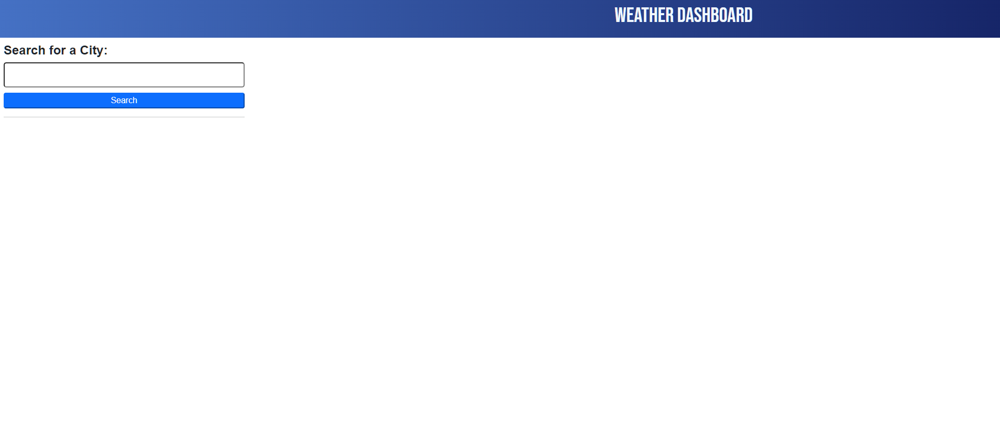
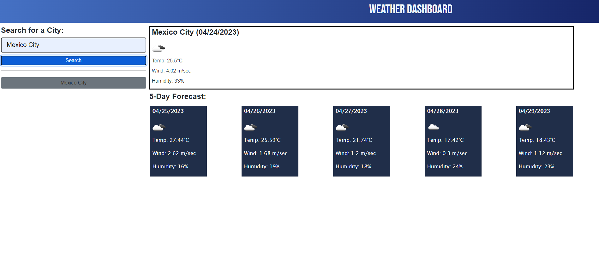

# SS-API
This repo is created for the 06 challenge of the EdX &amp; Tec de Monterrey bootcamp.

## Description

This web application is an weather forecast site that uses the OpenWeather API to retrieve information from the server and prints the current weather at the city the user wrote on the input. It also shows the user the 5 day forecast and displays the information on cards.

## Mockup

The site should have the functionality described in the following image:

## Link

Follow this URL to access the website: https://alextrejo92.github.io/SS-API/

## Installation

N/A

## Credits

The web page design was provided by EdX bootcamps & Tec de Monterrey. The functionality of the page was coded by me with assistance from an EdX Tutor.

## License

Standar MIT license.